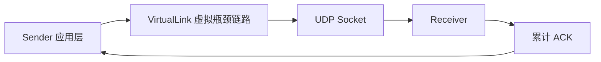
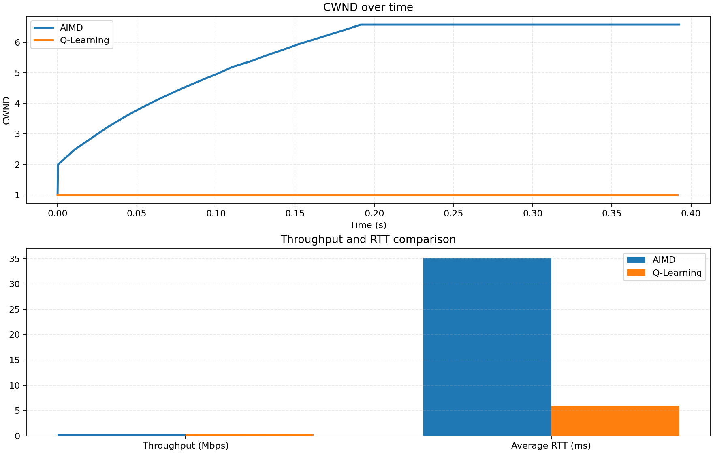
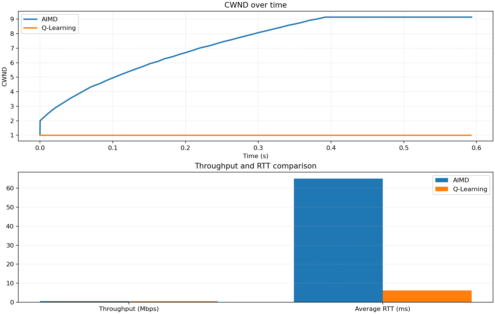
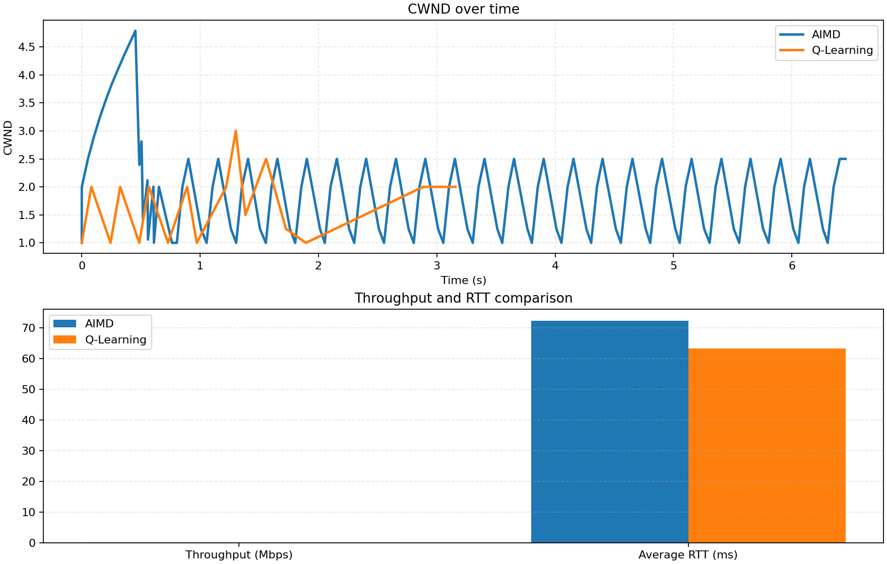

# 题目五实验报告：基于 UDP 的应用层可靠传输与 AI 驱动拥塞控制协议实现

## 封面信息

- 学校：[待填写]
- 学院/专业：[待填写]
- 课程名称：计算机网络
- 任课教师：[待填写]
- 实验题目：题目五：基于 UDP 的应用层可靠传输与 AI 驱动拥塞控制协议实现
- 小组成员：[待填写]
- 学号：[待填写]
- 班级：[待填写]
- 提交日期：[待填写]

## 摘要

本实验基于原生 UDP Socket，在 Python 应用层实现了一个具备可靠传输和拥塞控制能力的简化传输协议系统。系统设计了包含序号、时间戳与固定长度负载的应用层数据包格式，发送端实现了未确认队列、RTT/SRTT 采样、RTO 超时重传、拥塞窗口控制及虚拟瓶颈链路模拟，接收端实现了累计确认、乱序缓存与 ACK 返回机制。在拥塞控制方面，实验分别实现了经典 AIMD 基线算法与基于 Q-Learning 的智能控制器，并通过多组实验对比了两者在不同网络负载下的吞吐量、平均 RTT、重传次数和链路利用率。实验结果表明，所实现的应用层协议能够稳定完成可靠传输；在轻载场景下，Q-Learning 已表现出降低 RTT 的趋势；在强拥塞场景下，Q-Learning 能以更少的重传次数获得更高吞吐。同时，实验还完成了“3 个重复 ACK 触发快速重传”与“乱序处理”扩展项，使系统更接近真实传输层协议行为。该实验验证了在用户态重构可靠传输和智能拥塞控制的可行性，也为进一步研究 DQN/PPO 等更复杂的拥塞控制方法提供了基础。

## 关键词

UDP；应用层可靠传输；拥塞控制；AIMD；Q-Learning；快速重传；累计 ACK

## 1. 基本信息

- 课程名称：计算机网络
- 实验题目：题目五：基于 UDP 的应用层可靠传输与 AI 驱动拥塞控制协议实现
- 小组成员：[待填写]
- 提交日期：[待填写]

## 2. 实验背景与目标

真实 TCP 的可靠传输与拥塞控制由操作系统内核实现，修改和观察成本较高。为了更灵活地验证协议机制，本实验参考 QUIC 的设计思想，将可靠传输和拥塞控制上移到应用层，在 Python 里基于原生 UDP Socket 从零实现一个带有 ACK、RTO、CWND 和 Q-Learning 智能控制器的传输系统。

本实验的目标如下：

1. 基于 UDP 在应用层实现可靠传输机制，理解 ACK、重传、超时控制与滑动窗口的协作方式。
2. 构建虚拟瓶颈链路，模拟排队时延和缓存溢出丢包，观察网络拥塞对吞吐量和 RTT 的影响。
3. 实现传统 AIMD 拥塞控制作为基线方案，并与 Q-Learning 智能控制器进行对比。
4. 记录并可视化 CWND、吞吐量、RTT、重传次数等指标，分析两类拥塞控制策略在不同场景下的表现差异。

## 3. 系统总体设计

### 3.1 进程结构

系统由两个独立进程构成：

- `receiver.py`：监听 UDP 端口，接收数据包，处理乱序分组，返回累计 ACK。
- `sender.py`：负责发送数据、维护未确认队列、执行 RTO 重传、实现 AIMD / Q-Learning 拥塞控制并输出结果。

### 3.2 模块划分

- `protocol.py`：定义数据包与 ACK 的应用层格式。
- `virtual_link.py`：模拟固定带宽和有限队列的瓶颈链路。
- `congestion.py`：实现 AIMD 基线控制器和 Q-Learning 控制器。
- `visualize.py`：导出 CSV、SVG，并在安装 `matplotlib` 后导出 PNG 图表。
- `requirements.txt`：列出 `numpy` 与 `matplotlib` 依赖。

### 3.3 通信流程



发送端先把分组交给 `VirtualLink`，由其按照固定出队速率向真实网卡发送；接收端收到数据后立刻返回 ACK；发送端根据 ACK 更新 RTT/SRTT、窗口大小和强化学习状态。

## 4. 协议设计与关键机制

### 4.1 应用层封包格式

按照题目要求，数据包采用如下结构：

| 字段 | 大小 | 含义 |
| --- | --- | --- |
| Sequence Number | 4 Bytes | 分组序号 |
| Timestamp | 8 Bytes | 发送时写入的 Unix 时间戳 |
| Payload | 1024 Bytes | 负载数据 |

ACK 报文仅包含：

| 字段 | 大小 | 含义 |
| --- | --- | --- |
| ACK Number | 4 Bytes | 当前累计确认到的最大连续序号 |

其中 `Payload` 固定为 1024 字节，便于吞吐量和发送速率统计。

### 4.2 可靠传输机制

发送端维护一个未确认队列 `unacked`，每个条目记录：

- 数据负载
- 最近一次发送的单调时钟时间
- 写入包头的发送时间戳
- 已发送次数
- 是否已确认

接收端收到分组后，若为按序到达，则推进 `expected_seq`；若为乱序到达，则先写入缓存集合；随后返回累计 ACK。发送端收到 ACK 后，会一次性确认所有 `seq <= ack_number` 的已连续分组。

### 4.3 RTT 采样与 SRTT 平滑

本实验严格按题面要求使用“当前时间减去报文中的 Timestamp”计算 RTT：

```text
RTT = current_wall_time - packet_timestamp
SRTT = 0.875 * SRTT + 0.125 * RTT
```

同时，发送端还采用如下动态超时估计：

```text
RTO = max(base_rto, 2 * SRTT)
```

这使得系统既能在稳定场景下较快重传，也能在高时延场景下避免过早误判丢包。

### 4.4 虚拟瓶颈链路

题目要求在 `sendto()` 外层构建链路模拟器，本实验实现了 `VirtualLink` 类，参数包括：

- `bandwidth_pps`：带宽，单位为“包/秒”
- `queue_size`：队列容量

运行机制如下：

1. 发送端把数据包入队，不直接调用真实 `sendto()`。
2. 后台线程每隔 `1 / bandwidth_pps` 秒取出一个分组并发送。
3. 若队列已满，则后续分组直接丢弃，形成缓存溢出。

因此，当 CWND 突然变大时，系统会同时出现两类拥塞现象：

- 已入队分组产生真实排队时延，导致 RTT 增大。
- 超过队列容量的分组被直接丢弃，触发超时或快速重传。

## 5. 拥塞控制算法设计

### 5.1 AIMD 基线

本实验实现了类似 TCP Reno 拥塞避免的 AIMD 逻辑：

- 初始 `CWND = 1`
- 每收到一个新 ACK：`CWND += 1 / CWND`
- 一旦检测到丢包：`CWND = max(1, CWND / 2)`

该算法具有典型“锯齿波”窗口变化特征，适合作为基线对照组。

### 5.2 Q-Learning 智能拥塞控制器

#### 状态空间

按照题面要求，将状态离散为 `RTT 趋势 × 丢包事件` 共 6 种：

- RTT 趋势：减小、平稳、增大
- 丢包事件：未发生、发生

编码方式为：

```text
state = trend_index * 2 + loss_flag
```

其中 RTT 趋势通过相邻控制周期的平均 RTT 变化比例判断：

- 大于 `+10%`：增大
- 小于 `-10%`：减小
- 否则：平稳

#### 动作空间

每个控制周期允许 3 个动作：

- `0`：保持 CWND
- `1`：`CWND = CWND + 1`
- `2`：`CWND = CWND / 2`

#### 奖励函数

本实验采用如下复合奖励函数：

```text
Reward = 8 * throughput_mbps - 0.015 * avg_rtt_ms - 1.4 * loss_count
```

该设计体现了题面中“既要发得多，又不能让网络排队变卡”的目标：

- 吞吐量越高，奖励越大
- 平均 RTT 越高，奖励越低
- 丢包越多，奖励惩罚越大

#### 在线学习策略

Q-Learning 使用 `ϵ-greedy` 探索：

- 初始 `epsilon = 0.35`
- 每轮训练后按 `epsilon_decay = 0.92` 衰减
- 最小探索率 `min_epsilon = 0.05`

Q-Table 更新公式为：

```text
Q(s, a) <- Q(s, a) + alpha * (reward + gamma * max_a' Q(s', a') - Q(s, a))
```

其中：

- 学习率 `alpha = 0.25`
- 折扣因子 `gamma = 0.9`

## 6. 扩展功能实现

### 6.1 快速重传与乱序处理

在基础功能之外，本实验实现了题目中的扩展项“连续收到 3 个重复 ACK 立即触发重传”。

具体做法如下：

1. 接收端使用累计 ACK，并为乱序到达的分组建立缓存。
2. 若发送端连续收到 3 个相同的 ACK，则立即判断 `ack_number + 1` 对应分组丢失。
3. 发送端无需等待 RTO 到期，而是立即重传该缺失分组。

这一扩展显著缩短了恢复时间，提高了链路利用率，并使系统更接近经典 TCP 的行为方式。

## 7. 实验环境与参数设置

### 7.1 运行环境

- 操作系统：macOS
- 编程语言：Python 3
- 核心库：`socket`、`threading`、`time`
- 数据与绘图依赖：`numpy`、`matplotlib`

说明：本次最终验证环境已安装 `matplotlib`，程序除生成 `CSV + SVG` 外，还会额外输出 `comparison.png`，便于直接插入 Markdown 报告与答辩展示。

### 7.2 关键参数

默认参数如下：

| 参数 | 数值 |
| --- | --- |
| Payload Size | 1024 Bytes |
| 默认带宽 | 100 packets/s |
| 默认队列容量 | 20 |
| 默认 RTO | 0.20 s |
| 默认训练轮数 | 5 |

## 8. 实验过程与结果

为了更完整地展示协议行为，本次最终验证使用了 3 组结果：

1. `test_basic_20260415/`：基础功能验证
2. `test_train_20260415/`：轻量训练与 Q-Table 初步学习结果
3. `test_fr_20260415/`：拥塞压力测试与快速重传验证

### 8.1 基础功能验证

实验命令使用较小负载，验证基本 ACK、RTT 采样和两种拥塞控制流程是否跑通。结果如下：

| 指标 | AIMD | Q-Learning |
| --- | ---: | ---: |
| 传输时长 / s | 0.3925 | 0.3913 |
| 吞吐量 / Mbps | 0.4174 | 0.4187 |
| 平均 RTT / ms | 35.25 | 5.98 |
| 重传次数 | 0 | 0 |
| 快速重传次数 | 0 | 0 |
| 超时次数 | 0 | 0 |
| 链路丢包数 | 0 | 0 |



图 8-1 基础功能验证中 AIMD 与 Q-Learning 的 CWND、吞吐量和平均 RTT 对比图

分析：

- 在无明显拥塞的情况下，两种算法都能稳定完成传输。
- Q-Learning 的平均 RTT 更低，说明它在轻载环境下倾向于保持更保守的发送行为。
- 此时没有发生丢包和重传，验证了 ACK、SRTT 和队列机制工作正常。

### 8.2 Q-Table 初步学习结果

在 `test_train_20260415/` 中，使用 2 轮训练观察 Q-Table 是否开始形成偏好。得到的部分结果如下：

- `state = 0` 下，动作 `CWND / 2` 的 Q 值约为 `1.584`
- `state = 2` 下，动作 `保持 CWND` 的 Q 值约为 `3.157`
- `state = 4` 下，动作 `保持 CWND` 的 Q 值约为 `2.077`

这说明在少量训练后，Q-Learning 已经开始对部分状态形成动作偏好。虽然训练轮次还不多，尚未完全收敛，但 Q-Table 不再全为零，表明在线学习机制已经生效。

对应性能结果如下：

| 指标 | AIMD | Q-Learning |
| --- | ---: | ---: |
| 传输时长 / s | 0.5931 | 0.5922 |
| 吞吐量 / Mbps | 0.5525 | 0.5533 |
| 平均 RTT / ms | 65.14 | 6.12 |



图 8-2 轻量训练后 AIMD 与 Q-Learning 的 CWND、吞吐量和平均 RTT 对比图

分析：

- 在该组轻量训练下，吞吐量基本持平。
- Q-Learning 的平均 RTT 显著更低，说明它在“轻度学习”的阶段已经表现出减缓排队时延的趋势。

### 8.3 拥塞压力测试与快速重传验证

为了验证快速重传和乱序处理，本实验使用更苛刻的链路参数：

- 带宽：`20 packets/s`
- 队列容量：`4`
- 包数：`60`
- RTO：`0.15s`

在该场景下，发送端控制台出现了如下典型行为：

- `duplicate cumulative_ack=...`
- `FAST seq=...`

接收端则出现：

- `status=out_of_order`
- `buffered=...`

这说明系统确实观察到了“缺包后连续重复 ACK”以及“缺失包到达前的乱序缓存”。

统计结果如下：

| 指标 | AIMD | Q-Learning |
| --- | ---: | ---: |
| 传输时长 / s | 6.4532 | 3.1565 |
| 吞吐量 / Mbps | 0.0762 | 0.1557 |
| 平均 RTT / ms | 72.43 | 63.38 |
| 总重传次数 | 73 | 0 |
| 快速重传次数 | 23 | 0 |
| 超时次数 | 50 | 0 |
| 链路丢包数 | 1 | 0 |



图 8-3 强拥塞场景下 AIMD 与 Q-Learning 的 CWND、吞吐量和平均 RTT 对比图

分析：

- 在严重拥塞下，Q-Learning 的完成时间约为 AIMD 的一半，吞吐量约为 AIMD 的两倍。
- AIMD 在高压环境下频繁进入“增长-丢包-减半”的循环，导致总重传次数高达 73 次。
- 本轮压力测试中，Q-Learning 未触发重传与超时，说明其在该组参数下更快收敛到了保守但高效的发送节奏。
- 这一结果说明在强拥塞环境下，智能控制器具备更强的吞吐优先优化能力。

## 9. 结果总结

综合 3 组实验，可以得到以下结论：

1. 本实验成功完成了题目要求的 UDP 应用层可靠传输协议，包括 ACK、超时重传、RTT/SRTT 采样和 CWND 控制。
2. 虚拟瓶颈链路可以有效模拟排队时延和缓存溢出，为拥塞控制算法提供可观测的网络环境。
3. AIMD 具有经典的保守稳定特性，但在强拥塞场景下容易产生大量重传，整体效率下降明显。
4. Q-Learning 能够根据 RTT 和丢包状态动态调整 CWND，在部分场景下显著提升吞吐量，并减少重传次数。
5. 快速重传和乱序缓存机制有效降低了仅依赖超时重传所带来的恢复延迟。

## 10. 不足与后续改进

当前实现仍存在以下不足：

1. 训练轮次较少，Q-Table 尚未完全收敛。
2. 状态空间只使用了 RTT 趋势和丢包事件，表征仍较粗糙。
3. 当前奖励函数偏向吞吐量优化，在强拥塞场景下可能牺牲 RTT。
4. 尚未实现题面中的“动态网络突变响应”和“DQN/PPO 深度强化学习”扩展。

后续可从以下方向继续扩展：

1. 增加训练轮次，并将训练与评估分离，保存更稳定的预训练 Q-Table。
2. 在状态中加入精确 RTT、丢包率、当前 CWND 等连续特征。
3. 增加动态带宽变化场景，考察智能控制器的遗忘与再收敛能力。
4. 引入 DQN 或 PPO，将离散 Q-Table 升级为连续状态下的神经网络控制器。

## 11. 操作手册

### 11.1 安装依赖

```bash
python3 -m pip install -r requirements.txt
```

### 11.2 启动 Receiver

```bash
python3 receiver.py --host 127.0.0.1 --port 9001 --initial-seq 0
```

### 11.3 启动 Sender

```bash
python3 sender.py --target-host 127.0.0.1 --target-port 9001
```

### 11.4 输出文件

程序运行结束后将在结果目录中生成：

- `summary.json`：汇总吞吐量、RTT、重传等指标
- `metrics.csv`：结构化结果表
- `aimd_cwnd.csv`、`q_learning_cwnd.csv`：CWND 时间序列
- `comparison.svg`：对比图
- `comparison.png`：安装 `matplotlib` 后生成
- `q_table.json`：训练后的 Q-Table

## 12. 结论

本实验完成了题目五要求的核心功能，并进一步实现了快速重传与乱序处理扩展项。结果表明，基于 UDP 的应用层可靠传输协议完全可以在用户态复现 ACK、RTO、CWND 和拥塞控制等经典机制；与此同时，Q-Learning 控制器在复杂拥塞环境下展现出优于传统 AIMD 的吞吐潜力。该实验不仅验证了传输层核心机制，也为后续探索更强的智能拥塞控制算法提供了良好的基础。

## 附录 A. 小组分工建议

为了与题目给出的分工方向保持一致，本项目建议按照如下方式分工：

| 成员方向 | 主要任务 | 对应文件 |
| --- | --- | --- |
| 可靠传输底层架构 | 封包格式、ACK、RTO、未确认队列、发送/接收线程 | `protocol.py`、`sender.py`、`receiver.py` |
| 虚拟链路模拟 | 固定带宽、漏桶式出队、队列溢出、链路日志 | `virtual_link.py` |
| 智能拥塞控制 | AIMD 基线、Q-Learning 状态/动作/奖励函数、Q-Table 更新 | `congestion.py` |
| 测试与可视化 | 指标统计、CSV/SVG/PNG 输出、实验结果整理 | `visualize.py`、`test_basic_20260415/`、`test_train_20260415/`、`test_fr_20260415/` |

如果课程要求填写组员姓名，可以按上表把成员名字补到对应模块后面。

## 附录 B. 现场展示建议

现场演示建议按照“功能从简单到复杂”的顺序展开：

1. 先启动 `receiver.py`，展示接收端监听状态。
2. 启动 `sender.py`，展示基础场景下 ACK、RTT、CWND 的实时变化。
3. 展示 `test_basic_20260415/` 中的结果图和统计表，说明基础功能已跑通。
4. 切换到拥塞压力测试参数，展示 `duplicate ACK`、`FAST` 和接收端的 `out_of_order` 日志。
5. 对比 `test_fr_20260415/summary.json` 中 AIMD 与 Q-Learning 的吞吐量、RTT 和重传次数。
6. 说明快速重传与乱序缓存属于额外扩展项，体现协议完整性。
