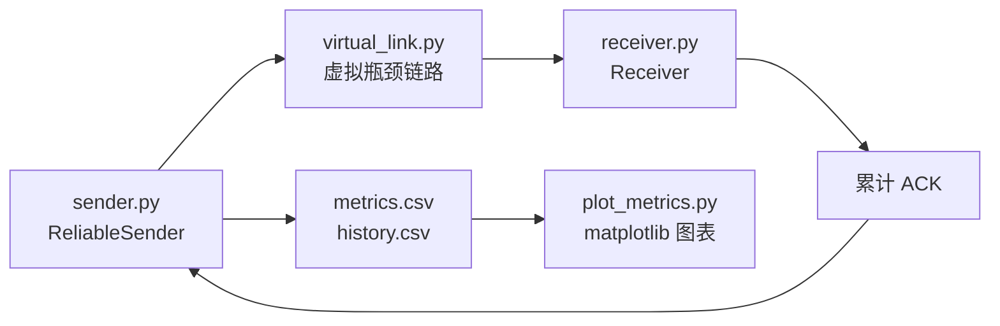

# 题目五实验提交文档：基于 UDP 的可靠传输与智能拥塞控制

## 一、项目概述

本项目对应计算机网络 CS3611 大作业题目五，目标是在 UDP 之上实现应用层可靠传输，并进一步构建虚拟瓶颈链路，比较 AIMD 与 Q-Learning 两种拥塞控制策略的传输表现。

项目使用 Python 3 原生 Socket 编程实现。发送端与接收端通过本地环回地址 `127.0.0.1` 进行 UDP 通信，发送端在 UDP Payload 中封装自定义协议头，接收端返回累计 ACK。系统支持滑动窗口、RTO 超时重传、快速重传、虚拟链路队列溢出模拟、AIMD 拥塞控制、Q-Learning 拥塞控制，以及实验指标记录和 matplotlib 绘图。

## 二、设计文档

### 2.1 系统架构

系统由以下模块组成：

| 文件 | 功能 |
| --- | --- |
| `protocol.py` | 定义数据包和 ACK 的封装与解析函数 |
| `receiver.py` | UDP 接收端，负责接收数据包、维护累计 ACK、处理乱序缓存 |
| `sender.py` | UDP 可靠发送端，负责滑动窗口、ACK 处理、重传、拥塞控制和指标记录 |
| `virtual_link.py` | 虚拟瓶颈链路，模拟固定服务速率和有限队列容量 |
| `plot_metrics.py` | 读取实验 CSV，绘制 CWND 曲线和吞吐量/RTT 对比图 |
| `q_table.json` | Q-Learning 训练得到的 Q-Table，可作为预训练模型权重提交 |
| `metrics.csv` | 每轮实验的汇总指标 |
| `history.csv` | 每轮实验过程中 CWND 和 RTT 的时间序列记录 |

整体流程如下：



发送端负责产生固定大小 Payload，并为每个分组分配递增序号。数据包经过虚拟瓶颈链路后到达接收端。接收端按序推进 `expected_seq`，并返回当前最大连续确认序号。发送端收到 ACK 后删除已确认分组并滑动窗口。

### 2.2 应用层 UDP 协议头

本实验没有直接裸传数据，而是在 UDP Payload 内定义应用层协议头。

数据包格式：

| 字段 | 大小 | 说明 |
| --- | ---: | --- |
| Sequence Number | 4 Bytes | 当前数据分组序号 |
| Timestamp | 8 Bytes | 发送端写入的 Unix 时间戳，用于 RTT 计算 |
| Payload | 1024 Bytes | 固定长度负载 |

代码定义：

```python
PAYLOAD_SIZE = 1024
DATA_HEADER_FORMAT = "!Id"
DATA_HEADER_SIZE = struct.calcsize(DATA_HEADER_FORMAT)
```

其中：

- `!` 表示网络字节序。
- `I` 表示 4 字节无符号整数，用于序号。
- `d` 表示 8 字节浮点数，用于时间戳。

ACK 报文格式：

| 字段 | 大小 | 说明 |
| --- | ---: | --- |
| ACK Number | 4 Bytes | 当前已经连续收到的最大序号，`-1` 表示还未收到连续分组 |

代码定义：

```python
ACK_FORMAT = "!i"
ACK_SIZE = struct.calcsize(ACK_FORMAT)
```

### 2.3 可靠传输机制

#### 2.3.1 滑动窗口

发送端维护 `unacked` 字典保存尚未被确认的分组。主线程持续检查窗口内未确认数量，只要 `len(unacked) < cwnd`，就继续发送新分组。

核心逻辑：

```text
while next_seq < end_seq and len(unacked) < cwnd:
    send_new_packet(next_seq)
    next_seq += 1
```

固定窗口模式下，`cwnd` 等于启动参数 `--window-size`。AIMD 和 Q-Learning 模式下，`cwnd` 由拥塞控制器动态调整。

#### 2.3.2 累计 ACK

接收端维护 `expected_seq`：

- 如果收到 `seq == expected_seq`，说明分组按序到达，接收端将 `expected_seq` 加 1。
- 如果之后缓存中已有连续后续分组，则继续推进 `expected_seq`。
- 如果收到更大的序号，说明发生乱序，接收端先缓存该序号。
- 每次处理完后返回 `expected_seq - 1` 作为累计 ACK。

发送端收到 ACK 后，删除所有 `seq <= ack_number` 的未确认分组，完成窗口滑动。

#### 2.3.3 RTO 超时重传

发送端为每个未确认分组保存最近发送时间。Timer 线程周期性扫描 `unacked`：

```text
if now - last_send_monotonic >= rto:
    retransmit(packet)
```

发生 RTO 时，发送端重新封装该分组，并写入新的时间戳。该机制保证即使 UDP 数据包丢失，也能通过重传最终到达。

#### 2.3.4 快速重传

当接收端持续收到乱序分组时，会反复返回相同的累计 ACK。发送端统计重复 ACK：

```text
if duplicate_ack_count >= 3:
    retransmit(ack_number + 1)
```

快速重传可以在 RTO 超时前提前恢复丢失分组，减少等待时间。

### 2.4 虚拟瓶颈链路设计

`virtual_link.py` 模拟固定带宽与有限缓存的瓶颈链路。发送端调用 `sendto()` 时，数据包先进入虚拟队列，再由后台线程按照固定服务间隔转发到真实 UDP Socket。

主要参数：

| 参数 | 含义 |
| --- | --- |
| `--link-queue-capacity` | 虚拟链路队列容量，队列满时新分组被丢弃 |
| `--link-service-delay-ms` | 每个分组的服务间隔，数值越大表示链路越慢 |
| `--link-bandwidth-drop-after-packets` | 转发到指定包数后触发带宽突变，0 表示关闭 |
| `--link-bandwidth-drop-factor` | 突变后的带宽倍率，0.5 表示带宽减半 |
| `--disable-virtual-link` | 关闭虚拟链路，直接使用 UDP 发送 |

队列满时，控制台会输出：

```text
[VLINK][DROP] queue_full ...
```

这可用于现场展示丢包和重传机制。

若要展示动态网络突变，可在发送端加入：

```powershell
--link-bandwidth-drop-after-packets 150 --link-bandwidth-drop-factor 0.5
```

虚拟链路会在日志中输出 `[VLINK][BANDWIDTH]`，表示服务间隔已变大、瓶颈带宽已降低。

### 2.5 AIMD 拥塞控制

AIMD 是经典 TCP 拥塞控制思想的简化实现：

- 收到 ACK 时加性增大：

```text
CWND = CWND + newly_acked / CWND
```

- 发生 RTO 或快速重传时乘性减小：

```text
CWND = max(1, CWND / 2)
```

因此 AIMD 的 CWND 曲线通常表现为逐步上升、拥塞后骤降、再逐步上升，即典型锯齿波。

### 2.6 Q-Learning 拥塞控制

Q-Learning 控制器将网络状态离散化，并根据奖励函数选择窗口调整动作。

状态设计：

| 维度 | 取值 |
| --- | --- |
| RTT 趋势 | RTT 上升、RTT 下降、RTT 基本不变 |
| 丢包标志 | 当前控制周期内是否出现 RTO/FAST 重传 |

二者组合形成 6 个离散状态。

动作空间：

| 动作编号 | 含义 |
| ---: | --- |
| 0 | 保持当前 CWND |
| 1 | `CWND = CWND + 1` |
| 2 | `CWND = CWND / 2` |

奖励函数：

```text
reward = acked_packets - 20 * average_rtt - 2 * losses
```

该奖励鼓励更高吞吐，同时惩罚高 RTT 和丢包。训练结果保存在 `q_table.json` 中。由于本项目采用表格型 Q-Learning，`q_table.json` 即为题目要求中的预训练 Q-Table/模型权重文件。

## 三、测试报告

### 3.1 测试环境

| 项目 | 配置 |
| --- | --- |
| 操作系统 | Windows |
| Python | Python 3 |
| 通信地址 | `127.0.0.1` 本地环回 |
| 接收端端口 | `9001` |
| 发送端默认本地端口 | `9000` |
| 绘图库 | matplotlib |

### 3.2 测试方法

实验分别运行 AIMD 和 Q-Learning 两种拥塞控制模式，每轮发送 300 个 UDP 数据分组，使用虚拟瓶颈链路模拟网络拥塞。发送端记录每轮实验的吞吐量、平均 RTT、重传次数等指标，并将 CWND/RTT 时间序列写入 `history.csv`。

AIMD 测试命令：

```powershell
python sender.py --target-host 127.0.0.1 --target-port 9001 --cc-mode aimd --window-size 1 --max-cwnd 80 --packets 300 --rto 0.2 --metrics-file metrics.csv --history-file history.csv
```

Q-Learning 测试命令：

```powershell
python sender.py --target-host 127.0.0.1 --target-port 9001 --cc-mode qlearning --window-size 1 --max-cwnd 80 --packets 300 --rto 0.2 --qtable-file q_table.json --metrics-file metrics.csv --history-file history.csv
```

绘图命令：

```powershell
python plot_metrics.py --metrics-file metrics.csv --history-file history.csv --output comparison_required.png
```

### 3.3 测试结果

本次测试结果如下：

| 模式 | 发送分组 | 确认分组 | 持续时间 | 吞吐量 | 平均 RTT | SRTT | 重传次数 | 快速重传 | RTO 次数 |
| --- | ---: | ---: | ---: | ---: | ---: | ---: | ---: | ---: | ---: |
| AIMD | 300 | 300 | 3.532 s | 0.695810 Mbps | 117.103 ms | 106.407 ms | 7 | 1 | 6 |
| Q-Learning | 300 | 300 | 3.563 s | 0.689756 Mbps | 18.839 ms | 28.819 ms | 0 | 0 | 0 |

生成图表：

- `comparison_required_cwnd.png`：CWND 随时间变化曲线。
- `comparison_required_throughput_rtt.png`：吞吐量与平均 RTT 柱状图。
- `comparison_required.png`：上述两类图的合并版本。

### 3.4 结果分析

从 CWND 曲线看，AIMD 在传输初期不断增大窗口，随后由于虚拟瓶颈链路队列压力上升出现丢包或重传，窗口被乘性减小，形成典型的锯齿波。该现象符合 AIMD 的拥塞避免特征。

Q-Learning 在读取预训练 Q-Table 后，将 CWND 控制在较低且较平滑的区间。它没有像 AIMD 一样快速推高窗口，因此减少了队列堆积和丢包风险。测试中，Q-Learning 的吞吐量为 0.689756 Mbps，与 AIMD 的 0.695810 Mbps 接近，但平均 RTT 从 AIMD 的 117.103 ms 降低到 18.839 ms，并且重传次数为 0。

这说明在当前虚拟瓶颈链路条件下，Q-Learning 策略更偏向低时延和稳定传输；AIMD 更激进，能快速提高窗口，但会引入更高 RTT 和重传。

## 四、操作手册

### 4.1 准备环境

进入项目目录：

```powershell
cd CS3611_ComputerNetworks_Project
```

安装绘图库：

```powershell
pip install matplotlib
```

### 4.2 启动接收端

打开第一个 PowerShell 终端：

```powershell
python receiver.py --host 127.0.0.1 --port 9001 --initial-seq 0
```

接收端会持续运行，实验结束后用 `Ctrl+C` 停止。

### 4.3 运行 AIMD 实验

打开第二个 PowerShell 终端：

```powershell
cd CS3611_ComputerNetworks_Project
python sender.py --target-host 127.0.0.1 --target-port 9001 --cc-mode aimd --window-size 1 --max-cwnd 80 --packets 300 --rto 0.2 --metrics-file metrics.csv --history-file history.csv
```

AIMD 实验结束后，建议停止并重启接收端，使下一轮 Q-Learning 实验从序号 0 开始。

### 4.4 运行 Q-Learning 实验

重新启动接收端后，在第二个终端运行：

```powershell
python sender.py --target-host 127.0.0.1 --target-port 9001 --cc-mode qlearning --window-size 1 --max-cwnd 80 --packets 300 --rto 0.2 --qtable-file q_table.json --metrics-file metrics.csv --history-file history.csv
```

如果 `q_table.json` 已存在，程序会读取该 Q-Table；如果不存在，程序会自动创建并保存。

### 4.5 生成图表

两轮实验完成后运行：

```powershell
python plot_metrics.py --metrics-file metrics.csv --history-file history.csv --output comparison_required.png
```

该命令会生成三张图：

| 文件 | 内容 |
| --- | --- |
| `comparison_required.png` | 合并版图表 |
| `comparison_required_cwnd.png` | CWND 随时间变化曲线 |
| `comparison_required_throughput_rtt.png` | 吞吐量与平均 RTT 柱状图 |

## 五、结论

本实验完成了题目五要求的 UDP 应用层可靠传输、虚拟瓶颈链路、AIMD 拥塞控制、Q-Learning 智能拥塞控制和 matplotlib 图表绘制。实验结果表明，两种算法均能完成可靠传输；AIMD 具有典型锯齿型窗口变化，但在瓶颈链路下产生更高 RTT 和重传；Q-Learning 在吞吐量接近的前提下显著降低平均 RTT，并避免重传，体现出更稳定的拥塞控制效果。
